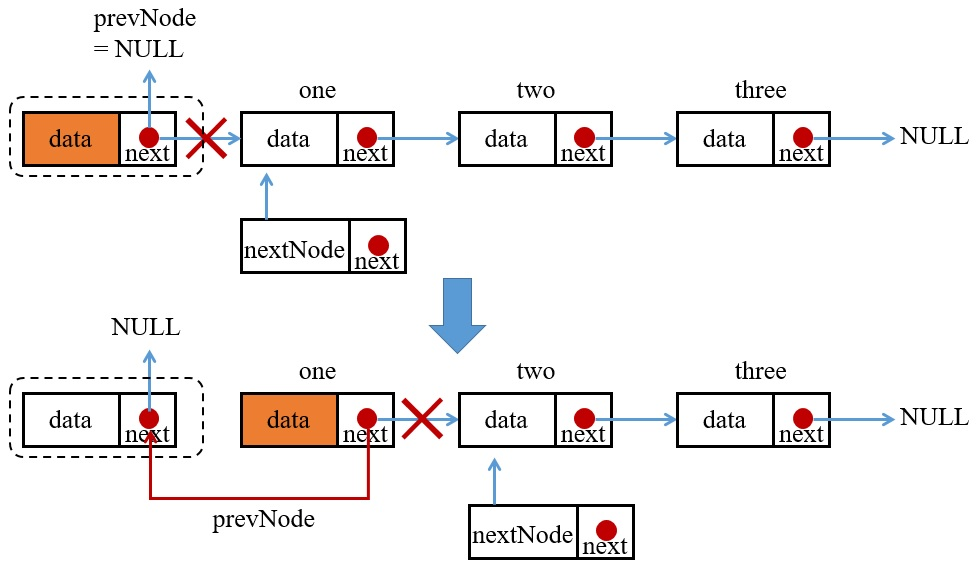

在 C 語言中內建的組合型別有陣列、結構、聯合、枚舉、函數等，陣列只能夠裝相同型別的物件，結構可裝不同型別的成員，而結構陣列只能裝相同類別的成員，若要自由的增減陣列內的成員，可搭配 malloc 與 free，但都不如 python 中的 list 方便。故在 C 語言中若要像 python 的 list 一樣就必須自己實作，在此稱為Linked List。

## 1. 單向 Linked List 實作
Linked List 的結構為許多的成員與勾環，此鉤環是與其他 list 串接的成員
```C
#include <stdio.h>
#include <stdlib.h>

typedef struct _node
{
    int data;
    struct _node *next;
}node;

node* newNode(int value)
{
    node *tmpNode = malloc(sizeof(node));
    if(tmpNode!=NULL) 
    {
        tmpNode->data = value;
        tmpNode->next = NULL;
    }
    return tmpNode;
}

int main()
{
    /* Initialize nodes */
    node *one = newNode(1);
    node *two = newNode(2);
    node *three = newNode(3);

    // connect the node
    one->next = two;
    two->next = three;
    three->next = NULL;
}
```

上面宣告了一個結構，裡面有一個整數變數的成員，與一個指標結構成員 * next，* next 即為用來與其他資料連結的鉤環。在此我們先宣告三個型別為 node 的指標並先指向 NULL，接著分別要了 node 大小的記憶體給三個指標。接著將裡面的資料賦值然後將其串起來，如此一來就完成了 Linked list 的串接。

## 2. 印出 list 中的資料
因為 list 的最後一個是指向 NULL，故當傳入一個 node 的結構指標，只要指標不為 NULL，就都印出來，印出來後指向下一個。
```C
void printList(node *list)
{
    while(list != NULL)
    {
        printf("%d\n", list->data);
        list = list->next;
    }
}
```
在 list 中能夠公開存取的只有第一個資料，但是因為紀錄的指向下一個位置的指標，所以可以訪問完整個 list。

## 3. 計算 list 長度
使用方式與印出 list 中所有元素並無不同。
```C
int lenOfList(node *list)
{
    int length = 0;
    while(list != NULL)
    {
        ++length;
        list = list->next;
    }
    return length;
}
```
## 4. 增加串接資料於 list 中
一般來說要改變陣列大小需用 malloc 宣告新陣列的大小，然後在將舊陣列 free，但使用 list，我們只要找到想插入的位置就可以了。在此分三種情況
#### 1. 在首插入
若有一個資料想放在 list 首，就先在裡面開一個新的 node 指標 newNode，將 data 放進去後，newNode 裡面的 next 指向原本的頭，最後再將 list 指向 newNode 即可。
```C
void insertHead(node **list, int value)
{
    node *new_node = newNode(value);
    newNode->next = *list;
    *list = newNode;
}
```

與 printList 不同，在此傳入一個指標的指標，是因為要改變原本的指標，故必須要先宣告一個指標指向傳入的 list。若是直接傳入指標 list，則因為是指向 list 了所以可以直接操作。
#### 2. 在尾插入
大部分的步驟一樣，只不過 newNode 最後要指向 NULL，然後另外開一個指標 temp 指向 list，找到目前存在 list 中最後一項物件，再把 temp 指向 newNode 即可。
```C
void insertEnd(struct node **list, int value)
{
    node *new_node = newNode(value);
    struct node *temp = *list;  //因為是一個指標的指標，所以我們要先開一個新的 node 指標指向 list
    while(temp->next != NULL) temp = temp->next;  //會一直指向後面的 node 直到最後一個
    temp->next = newNode;
}
```

#### 3. 在其他地方插入
大部分的步驟一樣，只不過要將第 n 個 node 指向 newNode，newNode 指向第 n+1 個 node，這樣就完成串接了。
```C
void insertMiddle(node **list, int value, int n)
{
    node *new_node = newNode(value);
    for(int i = 1; i < n; i++) if(temp->next != NULL) temp = temp->next;
    newNode->next = temp->next;
    temp->next = newNode;
}
```
而實作上可以考慮將插入函數寫成一個函數即可。

## 5. 刪除 list 中某位置資料
在此我們會先從頭開始尋找資料在 list 中哪個位置，然後再把那筆資料移除，如同插入一樣分成三種情況
#### 1. 刪除首位資料
同樣的先開一個指標 temp 來指向 list 的第一個位置，因為是要將首位資料刪除，所以再把 list 指向 temp 的 next，此時 list 就是到了第二個位置，接著再free(temp)即可。
```C
void deleteNode(node **list, int position) 
{
    if (*list == NULL) return; //如果本身就是空 list 則直接回傳

    node *temp = *list;
    if (position <= 0) 
    {
        *list = temp->next;
        free(temp);
        return;
    }
}
```

#### 2. 刪除其餘資料
刪除其他位置的節點需要開兩個指標，一個去存取 list 的頭，另一個則是把倒數第二個的節點存下來，將最後一個節點 free 調，並把原先倒數第二的 next 指向 NULL 即可。
```C
void deleteNode(node **list, int position)
{
    int length = lenOfList(*list);
    if (position >= length) position = length - 1;
    //在此先計算 list 長度，若欲刪除之位置 > 長度，則直接刪除最後一個
    for (int i = 0; temp != NULL && i < position - 1; ++i) temp = temp->next;
    //找到要刪除的位置的前一個
    if (temp == NULL || temp->next == NULL) return;
    //如果在第二個位置就已經是 NULL 了則直接回傳，代表 list 長度為 1。
    node *nodeToBeDel = temp->next;
    //將找到的位置的前一個另外開一個指標存下來
    temp->next = nodeToBeDel->next;
    //指向要被刪除的位置的下一個。
    free(nodeToBeDel);
}
```
倒數第三行為儲存倒數第二個資料勾環的位置，下一行則是把 temp->next 指向末位資料的鉤環，也就是指向 NULL 的鉤環，所以將最末位的資料刪除後仍是指向 NULL。


## 6. list 反轉
list 反轉需要另外開三個 node 才能完成，current 是要做移動，next 則是要存取移動中下一個指標，prev 則是指向前一個 node。
* 1. 將 current 指向 prve
* 2. 再將 prev 往後走一個 node
* 3. 接著將 current 往後移動一個 node
* 4. 接著重複以上三步驟直到最後一個為止
結束以上步驟後將 list 分配給 prev 即可。
```C
void reverse(node **list)
{
    node *prevNode = NULL, *current = *list, *nextNode = NULL;
    while (current != NULL) 
    {
        nextNode = current->next;
        current->next = prevNode;
        prevNode = current;
        current = nextNode;
    }
    *list = prevNode;
}
```

