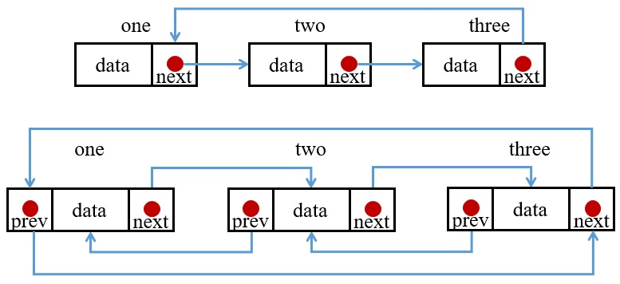

在單向或雙向鏈結中，最後一個指標會指向 NULL，但是環狀鏈結最後一個會指向頭節點，在此以單向環狀鏈結為例。

## 1. 環狀 Linked List 實作
```C
#include <stdio.h>
#include <stdlib.h>

typedef struct _node
{
    int data;
    struct _node *next;
}node;

node* newNode(int value)
{
    node *tmpNode = malloc(sizeof(node));
    if(tmpNode!=NULL) 
    {
        tmpNode->data = value;
        tmpNode->next = NULL;
    }
    return tmpNode;
}

int main()
{
    /* Initialize nodes */
    node *one = newNode(1);
    node *two = newNode(2);
    node *three = newNode(3);

    // connect the node
    one->next = two;
    two->next = three;
    three->next = one;
}
```
 \
除了最後要將最末端的節點指回頭，其他都與單向鏈結一樣。

## 2. 印出 list 中的資料
因為 list 的最後一個是指向 head，所以結束條件就是 list != head，但是因為一開始是從 head 進入，所以我們可以選擇先將第一個節點印出並讓 list 指向第二個，最後當 lise == head 即結束迴圈。
```C
void printList(node *list)
{
    node *ptr = list;
    printf("%d->", list->data);
    list = list->next;
    while(list != ptr)
    {
        printf("%d->", list->data);
        list = list->next;
    }
    printf("\n");
}
```

## 3. 計算 list 長度
使用方式與印出 list 中所有元素並無不同。
```C
int lenOfList(node *list)
{
    int length = 1;
    node *ptr = list;
    list = list->next;
    while(list != ptr)
    {
        ++length;
        list = list->next;
    }
    return length;
}
```
## 4. 增加串接資料於 list 中
#### 1. 在首插入
若有一個資料想放在 list 首，因為頭尾是連接的，所以若是要將新的 node 當作頭，則必須要再找到最後一個 node 將其接上。
```C
void insertHead(node **list, int value)
{
    node *new_node = newNode(value);
    node *temp = *list;
    node *ptr = *list;
    while(temp->next != ptr) temp = temp->next;//此迴圈是移動到末節點

    temp->next = new_node; //將末節點與新的頭節點接上
    new_node->next = *list;//新的首節點接上原本的 list
    *list = new_node;
}
```
#### 2. 在其餘地方插入
因為是環狀鏈結，所以可以看成一個無限長的單向鏈結，所以在尾插入與在其他地方插入是一樣的做法。
```C
void insert(node **list, int value, int position)
{
    node *new_node = newNode(value);
    node *temp = *list;
    int length = lenOfList(*list)
    if(position >= length)position = position%length;
    for(int i = 0; i < position; i++) if(temp->next != NULL) temp = temp->next;
    new_node->next = temp->next;
    temp->next = new_node;
}
```

## 5. 刪除 list 中某位置資料
#### 1. 刪除首位資料
因為頭尾是連接的，所以要將原本的末節點接到第二個節點。
```C
void deleteNode(node **list, int position)
{
    node *temp = *list;
    node *ptr = *list;
    while(temp->next != *list) temp = temp->next;
    
    *list = ptr->next;
    temp->next = *list;
    free(ptr);
}
```
#### 2. 刪除其餘位置
因為是環狀鏈結，所以可以看成一個無限長的單向鏈結，所以刪除末節點與在刪除其他節點是一樣的做法。
```C
void deleteNode(node **list, int position)
{
    node *temp = *list;
    int length = lenOfList(*list);
    if(position >= length) position = position%length;
    for (int i = 0; i < position - 1; ++i) temp = temp->next;
    node *nodeToBeDel = temp->next;
    temp->next = nodeToBeDel->next;
    free(nodeToBeDel);
}
```

## 6. list 反轉
