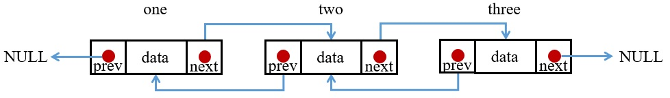

與單向連結相比，雙向連結在結構上多了一個指標，每個會比單向多出 4 Byte/8 Byte，但在使用上會比單向更自由方便。

## 1. 雙向 Linked List 實作
在結構上比單向多了一個 * prev，且在串接上要將尾端的 * prev 往前指向前一個 node 的 prev。
```C
#include <stdio.h>
#include <stdlib.h>

struct _node
{
    int data;
    struct _node *next;
    struct _node *prev;
}node;

node* newNode(int value)
{
    node *tmpNode = malloc(sizeof(node));
    if(tmpNode!=NULL) 
    {
        tmpNode->data = value;
        tmpNode->next = NULL;
        tmpNode->prev = NULL;
    }
    return tmpNode;
}

int main()
{
    /* Initialize nodes */
    node *one = newNode(1);
    node *two = newNode(2);
    node *three = newNode(3);

    // connect the node
    one->next = two;
    two->next = three;
    three->next = NULL;
    
    one->prev = NULL;
    two->prev = one;
    three->prev = two;
}
```


