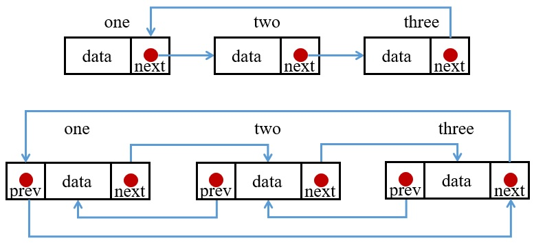

在單向或雙向鏈結中，最後一個指標會指向 NULL，但是環狀鏈結最後一個會指向頭節點，在此以單向環狀鏈結為例。

## 1. 環狀 Linked List 實作
```C
#include <stdio.h>
#include <stdlib.h>

typedef struct _node {
    int data;
    struct _node *next;
}node;

node* newNode(int value) {
    node *tmpNode = malloc(sizeof(node));
    if(tmpNode) {
        tmpNode->data = value;
        tmpNode->next = NULL;
    }
    return tmpNode;
}

int main() {
    /* Initialize nodes */
    node *one = newNode(1);
    node *two = newNode(2);
    node *three = newNode(3);

    // connect the node
    one->next = two;
    two->next = three;
    three->next = one;
}
```
 \
除了最後要將最末端的節點指回頭，其他都與單向鏈結一樣。

## 2. 印出 list 中的資料
因為 list 的最後一個是指向 head，所以結束條件就是 list != head，但是因為一開始是從 head 進入，所以我們可以選擇先將第一個節點印出並讓 list 指向第二個，最後當 lise == head 即結束迴圈。
```C
void printList(node *list) {
    node *ptr = list;
    printf("%d->", list->data);
    list = list->next;
    while(list) {
        printf("%d->", list->data);
        list = list->next;
    }
    printf("\n");
}
```

## 3. 計算 list 長度
使用方式與印出 list 中所有元素並無不同。
```C
int lenOfList(node *list) {
    int length = 1;
    node *ptr = list;
    list = list->next;
    while(list) {
        ++length;
        list = list->next;
    }
    return length;
}
```
## 4. 增加串接資料於 list 中
#### 1. 在首插入
若有一個資料想放在 list 首，因為頭尾是連接的，所以若是要將新的 node 當作頭，則必須要再找到最後一個 node 將其接上。
```C
void insertHead(node **list, int value) {
    node *new_node = newNode(value);
    node *temp = *list;
    node *ptr = *list;
    while(temp->next) temp = temp->next;//此迴圈是移動到末節點

    temp->next = new_node; //將末節點與新的頭節點接上
    new_node->next = *list;//新的首節點接上原本的 list
    *list = new_node;
}
```
#### 2. 在其餘地方插入
因為是環狀鏈結，所以可以看成一個無限長的單向鏈結，所以在尾插入與在其他地方插入是一樣的做法。
```C
void insert(node **list, int value, int position) {
    node *new_node = newNode(value);
    node *temp = *list;
    int length = lenOfList(*list)
    if(position >= length)position = position%length;
    for(int i = 0; i < position; i++) if(temp->next) temp = temp->next;
    new_node->next = temp->next;
    temp->next = new_node;
}
```

## 5. 刪除 list 中某位置資料
#### 1. 刪除首位資料
因為頭尾是連接的，所以要將原本的末節點接到第二個節點。
```C
void deleteNode(node **list, int position) {
    node *temp = *list;
    node *ptr = *list;
    while(temp->next != *list) temp = temp->next;
    
    *list = ptr->next;
    temp->next = *list;
    free(ptr);
}
```
#### 2. 刪除其餘位置
因為是環狀鏈結，所以可以看成一個無限長的單向鏈結，所以刪除末節點與在刪除其他節點是一樣的做法。
```C
void deleteNode(node **list, int position) {
    node *temp = *list;
    int length = lenOfList(*list);
    if(position >= length) position = position%length;
    for (int i = 0; i < position - 1; ++i) temp = temp->next;
    node *nodeToBeDel = temp->next;
    temp->next = nodeToBeDel->next;
    free(nodeToBeDel);
}
```

## 6. list 反轉
在此與單向鏈結差不多，只是最後要再讓原本的頭指向尾即可。
```C
void reverse(node **list) {
    node *prevNode = *list, *current = *list, *nextNode = NULL;
    while (nextNode)     {
        nextNode = current->next;
        current->next = prevNode;
        prevNode = current;
        current = nextNode;
    }
    current->next = prevNode;
    *list = prevNode;
}
```

## 7. Floyd Cycle Detection Algorithm
在做單向做鏈結時有可能不小心把尾端接到了其他地方，形成了一個單項鏈結與一個環狀鏈結，此時若呼叫其他單項鏈結的函數就可能會造成無窮迴圈。在此介紹一個避免此情況發生的算法：Floyd Cycle Detection Algorithm。此算法又稱龜兔賽跑演算法，由 Robert W. Floyd 提出。主要思路是若一個鏈結有環，則可以使用兩個一快一慢的 node 來檢查，當 next 指向同一位置時即表示兩指標在環狀鏈結裡面走了一陣子。在此算法中，快速指標一次走兩格，慢速指標一次走一格，所以可以利用此概念來算出環有多長。此算法有三個功能
1. 檢測鏈結是否有環
2. 若 1 成立，計算該環的長度
3. 若 1 成立，找出進入環的節點

#### 1. 檢測鏈結是否有環
此算法又稱龜兔賽跑演算法，由 Robert W. Floyd 提出。主要思路是若一個鏈結有環，則可以使用兩個一快一慢的 node 來檢查，當 next 指向同一位置時即表示兩指標在環狀鏈結裡面走了一陣子。在此算法中，快速指標一次走兩格，慢速指標一次走一格，所以可以利用此概念來算出環有多長。

#### 2. 計算環的長度
假設環的長度為 n，可以把快慢速指標**相遇的**位置記錄下來，然後用快指標整個走訪一圈，當走到的位置或下一個位置與相遇的相等即結束迴圈。

#### 3. 計算環的起點
假設環的長度為 n，起點到環的入口長度為 m，第一次相遇距環的入口為 k。已知快指標速度是慢指標的兩倍，設快指標第二次到**相遇**點時，快指標共走了 m + (n-k) + 2k 步，慢指標共走 m + k 步，又 2(m+k) = m + (n-k) + 2k，可得 m = n - k，即慢指標與快指標第一次相遇後，將快指標指向起點，然後走一次一步，接著慢指標繼續從相遇點往前走，在下一次遇到的點就是環的入口了。
```C
node *hasCycle(node *head) {
    int count = 0, cycle = 0;
    node *fast = head, *slow = head, *current = NULL;

    while (fast && fast->next) {
        //檢測是否有環
        fast = fast->next->next;
        slow = slow->next;
        if(fast == slow)         {
            cycle = 1;
            current = slow;
            break;
        }
    }

    //若有環，計算環的長度
    if(cycle) {
        slow = current->next;
        count = 1;
        while (slow != current) {
            slow = slow->next;
            ++count;
        }
        //若有環，找出進入環的節點
        fast = head;
        while(fast != current) {
            fast = fast->next;
            slow = slow->next;
        }
        slow->data = count;
    }
    else slow = NULL;
    return slow;
}
```
此算法檢測若鏈結沒有環，則會回傳 NULL，若有環則會回傳環的入口以及環的長度。
