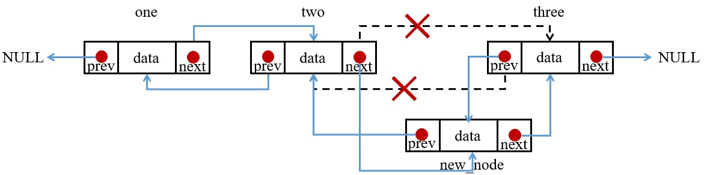
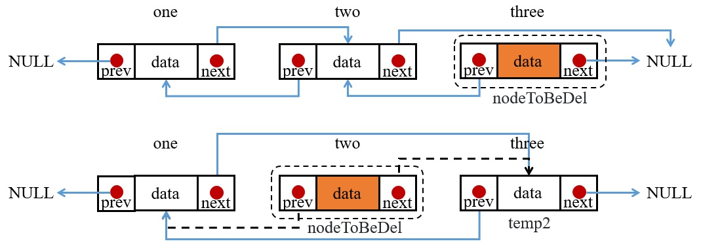

與單向連結相比，雙向連結在結構上多了一個指標，每個會比單向多出 4 Byte/8 Byte，但在使用上會比單向更自由方便。

## 1. 雙向 Linked List 實作
在結構上比單向多了一個 * prev，且在串接上要將尾端的 * prev 往前指向前一個 node 的 prev。
```C
#include <stdio.h>
#include <stdlib.h>

struct _node
{
    int data;
    struct _node *next;
    struct _node *prev;
}node;

node* newNode(int value)
{
    node *tmpNode = malloc(sizeof(node));
    if(tmpNode!=NULL) 
    {
        tmpNode->data = value;
        tmpNode->next = NULL;
        tmpNode->prev = NULL;
    }
    return tmpNode;
}

int main()
{
    /* Initialize nodes */
    node *one = newNode(1);
    node *two = newNode(2);
    node *three = newNode(3);

    // connect the node
    one->next = two;
    two->next = three;
    three->next = NULL;
    
    one->prev = NULL;
    two->prev = one;
    three->prev = two;
    node *head = one, *tail = three;
}
```


## 2. 印出 list 中的資料
雙向連結因為多了一個 prev 所以可以從後面往前印。
```C
void printList(node *list)
{
    while(list != NULL)
    {
        printf("%d\n", list->data);
        list = list->prev;
    }
}
```
而由前往後印與計算 list 長度皆與單向相同，故在此不再贅述。

## 3. 增加串接資料於 list 中
一般來說要改變陣列大小需用 malloc 宣告新陣列的大小，然後在將舊陣列 free，但使用 list，我們只要找到想插入的位置就可以了。在此分三種情況

#### 1. 在首插入
與單向連結大致上相同，但要記得傳入的 list 中的 prev 要指向 newNode。
```C
void insertHead(node **list, int value)
{
    node *new_node = newNode(value);
    (*list)->prev = new_node;
    new_node->next = *list;
    *list = new_node;
}
```

#### 2. 在尾插入
因為多了一個 prev，所以要記得把 new_node 的 prev 指向 temp。
```C
void insertEnd(struct node **list, int value)
{
    node *new_node = newNode(value);
    node *temp = *list;  //因為是一個指標的指標，所以我們要先開一個新的 node 指標指向 list
    while(temp->next != NULL) temp = temp->next;  //會一直指向後面的 node 直到最後一個
    temp->next = new_node;
    new_node->prev = temp;
}
```

3. 在其他地方插入
大部分的步驟一樣，只不過要將第 n 個 node 指向 newNode，newNode 指向第 n+1 個 node，這樣就完成串接了。
```C
void insertMiddle(node **list, int value, int position)
{
    node *new_node = newNode(value);
    node *temp = *list;
    for(int i = 1; i < position; i++) if(temp->next != NULL) temp = temp->next;
    new_node->next = temp->next;
    temp->next = new_node;
    new_node->prev = temp;
    temp->next->prev = new_node;
}
```
temp->next->prev 是指原本的第 n+1 個 node 的 prev。其中而實作上可以考慮將插入函數寫成一個函數即可。


## 5. 刪除 list 中某位置資料
在此我們會先從頭開始尋找資料在 list 中哪個位置，然後再把那筆資料移除，如同插入一樣分成三種情況

#### 1. 刪除首位資料
同樣的先開一個指標 temp 來指向 list 的第一個位置，因為是要將首位資料刪除，所以再把 list 指向 temp 的 next，此時 list 就是到了第二個位置，接著再free(temp)即可。
```C
void deleteNode(node **list, int position) 
{
    if (*list == NULL) return; //如果本身就是空 list 則直接回傳

    node *temp = *list;
    if (position <= 0) 
    {
        *list = temp->next;
        temp->next->prev = NULL;
        free(temp);
        return;
    }
}
```

#### 2. 刪除其餘資料
雙向鏈結在此與單向不同的地方在於，如果非最後一個節點，則還需要將被刪除節點的下一個 prev 指向被刪除節點的前一個節點，兩者在行為上有些許不同。
```C
void deleteNode(node **list, int position)
{
    int length = lenOfList(*list);
    if (position >= length) position = length - 1;
    //在此先計算 list 長度，若欲刪除之位置 > 長度，則直接刪除最後一個
    for (int i = 0; temp != NULL && i < position - 1; ++i) temp = temp->next;
    //找到要刪除的位置的前一個
    if (temp == NULL || temp->next == NULL) return;
    //如果在第二個位置就已經是 NULL 了則直接回傳，代表 list 長度為 1。
    node *nodeToBeDel = temp->next, *temp2;
    //將找到的位置的前一個另外開一個指標存下來
    if(nodeToBeDel->next == NULL)
    {
        temp->next = nodeToBeDel->next;
    }
    //如果 nodeToBeDel->next 為 NULL，表示此節點為最後一個節點，所以只要把前一個節點的 next 指向 NULL 即可。
    else
    {
        temp2 = nodeToBeDel->next;
        temp->next = temp2;
        temp2->prev = temp;
    }
    //如果 nodeToBeDel->next 不為 NULL，則要將前一個節點的 next 指向 nodeToBeDel 的下一個節點
    //並將 nodeToBeDel 的下一個節點的 prev 指向 nodeToBeDel 的前一個節點。
    free(nodeToBeDel);
}
```


## 6. 雙向 list 反轉
雙向 list 反轉比單向單純，可以想成只是 prev 與 next 做交換而已。
```C
void reverse(node **list)
{
    node *temp = NULL, *current = *list;
    while(current != NULL)
    {
        current->prev = current->next;
        current->next = temp;
        temp = current;
        current = current->prev;
    }
    *list = temp;
}
```
