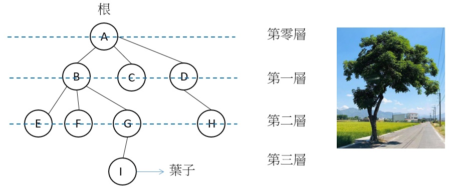
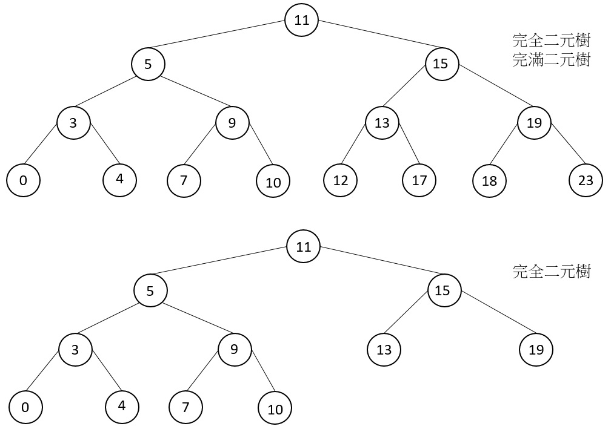
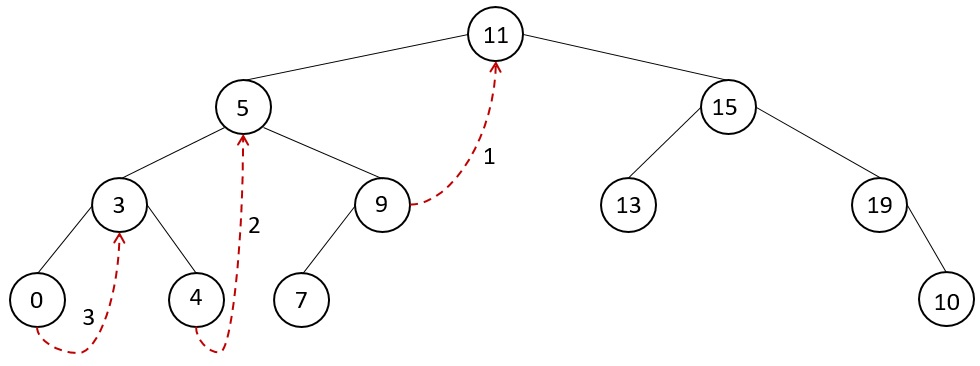
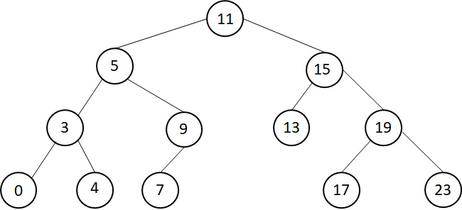
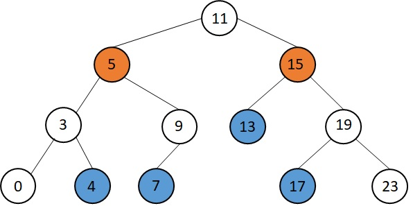

## 1. 介紹

樹是一種資料結構，如現實生活中一樣，由根往上長出許多樹枝與葉子。在樹狀結構中，有一個**最上面**的節點，稱為根結點，所以資料結構中的樹與現實生活中的樹剛好相反。根結點往下會長出子節點，每個子節點不互相連結，長出子節點的節點又稱作父節點，長出的子節點可追溯到同一個父節點，而最後一個子節點稱為葉，如圖所示。

https://udn.com/news/story/7327/5064320 \
而樹有很多種，在此以二元樹為主繼續往下介紹

## 2. 二元樹
二元樹是一種**至多**只有兩個子節點的樹狀資料結構，如同雙向鍊結一樣可以往左或往右，但是左右不串接。也可以使用陣列實作，但是在此以結構的方式實作，並有以下性質：
1. 第 i 層的節點個數最多有 2<sup>i</sup>−1 個。
2. 高度 h 的二元樹節點個數最多有 2<sup>h</sup>−1 個。 
3. 非空二元樹，若葉個數為 n<sub>0</sub> 個，degree 為 2 的節點個數為 n<sub>2</sub> 個，則 n<sub>0</sub> = n<sub>2</sub>+1。  
```C
typedef struct _node
{
    int data;
    struct _node *left;
    struct _node *right;
}node;

node* newNode(int value)
{
    node *tmpNode = malloc(sizeof(node));
    if(tmpNode!=NULL) 
    {
        tmpNode->data = value;
        tmpNode->left = NULL;
        tmpNode->right = NULL;
    }
    return tmpNode;
}

int main()
{
    /* Initialize nodes */
    node *root = newNode(1);
    node *root1_left = newNode(2);
    node *root1_right = newNode(3);
    node *root2_left = newNode(4);
    node *root2_right = newNode(5);
    
    root->left = root1_left;
    root->right = root1_right;
    root1_left->left = root2_left;
    root1_right->right = root2_right;
}
```
#### 1. 完滿二元樹 Full Binary Tree
若一個二元樹滿足以下性質，則稱為完美二元樹
1. 共有 2<sup>k</sup>-1 個節點
2. 節點個數一定為奇數
3. 第 i 層有 2<sup>i-1</sup> 個節點
4. 有 2<sup>k-1</sup> 個葉子

#### 2. 完全二元樹 Complete Binary Tree
在一棵二元樹中，當所有節點都是滿的，或是當節點不滿，而葉子從最左邊的左節點開始放入，再放入右節點，而後往右一個節點再依序放，則稱為完全二元樹


## 3. 印出數中所有資料
從根進入後可以分左右進入，所以印出所有元素共有四種組合
#### 1. Preorder Traversal 前序遍歷
從根進入後先印出資料，並先將根左邊的所有子節點印出，再走到根的右邊印出，當走到最後一個節點時就會到 NULL。
```C
void preorder(node *root) 
{
    printf("%d", root->data);
    if (root->left != NULL)  //若其中一側的子樹非空則會讀取其子樹
        preorder(root->left);
    if (root->right != NULL) //另一側的子樹也做相同事
        preorder(root->right);
}
```
此程式碼使用遞迴寫法，先印出資料後，當 root->left 不為空指標再執行此函數，因為呼叫此函數是會先印出該節點的資料，所以是先由上往下，直到左邊節點全部印完再換右邊。
#### 2. Inorder Traversal 中序遍歷
從最左邊的節點開始，由左至右，由下而上(葉子到根)印出，根的左邊節點全部走訪後再到右邊節點。
```C
void inorder(node *root) 
{
    if (root->left != NULL)  //若其中一側的子樹非空則會讀取其子樹
        inorder(root->left);
    printf("%d", root->data);
    if (root->right != NULL) //另一側的子樹也做相同事
        inorder(root->right);
}
```
#### 3. Postorder Traversal 後序遍歷
從最左邊的節點開始，每一層的節點由左至右印出，最後才會印到根。
```C
void postorder(node *root) 
{
    if (root->left != NULL)  //若其中一側的子樹非空則會讀取其子樹
        postorder(root->left);
    if (root->right != NULL) //另一側的子樹也做相同事
        postorder(root->right);
    printf("%d", root->data);
}
```
可發現此三個函數幾乎一樣，只差在印出資料的程式碼位置不同。

#### 4. Morris Traversal (Traversal iteratively) 迭代法走訪
https://leetcode.com/problems/binary-tree-inorder-traversal/
雖然使用遞迴(Recursive)寫法能讓 code 看起來非常簡潔，且能明確地看出以上三種寫法的差異，但是在空間與時間效率上皆不如迭代法，且太深層時容易造成 stack overflow，故實務上較少會使用遞迴法。在此以 preorder 為例，不論是哪一種寫法都是先走到左子樹的 NULL 再往右走。此方法利用一個多的節點 current 來當作 recursive 的 stack，記錄當下節點的左子節點，當左邊的節點走到 NULL 後再跳回 root 節點，並先往右節點走，然後再重複前一步，也就是當 root != NULL 時
1. 若 root->left == NULL 則印出資料，並往 root->right 走。
2. 若 root->left != NULL，利用 current 節點往 root 左子樹的最大值，並將該葉子的 right 指向 root，然後 root 再往走向左子節點。
3. 若 current->right == root，表示 root 也走到葉子了，此時將 current->right 還原為 NULL，root 再往回走像上一層節點。

因為 preorder 是先將 root 左子樹整個走訪後再往 root 右子樹走，所以利用葉子的 right 指向上層的 root，如此一來只須用到多一個 node 即可走訪整個二元樹。以此樹為例，第一次會將 root 左子樹的葉子 9 的右節點指向 11，然後 root 往左走向左節點，再來將 root 左子樹的左子樹的葉子 4 的右節點指向 5，以此類推。

```C
void morrisTraversalPreorder(struct node* root)
{
    node *current;
    while (root)
    {
        if (root->left == NULL)
        {
            printf( "%d ", root->data );
            root = root->right;
        }
        else
        {
            current = root->left;
            while (current->right && current->right != root) current = current->right;

            if (current->right == root)
            {
                root = root->right;
                current->right = NULL;
            }
            else
            {
                printf("%d ", root->data);
                current->right = root;
                root = root->left;
            }
        }
    }
}
```

## 4. 二元搜尋樹
 \
若樹中的資料都是同一種類，且按序排放，則稱為二元搜尋樹，其定義如下
1. 在"根"節點左邊的所有值皆小於根
2. 在"根"節點右邊的所有值皆大於根
3. 所有子樹皆為二元搜尋樹
4. 不存在任何鍵值 ( key/value ) 相等的節點。
因為順序排放，故算法時間平均為 O(logn)，最差 O(n)。
若為二元搜尋樹，則使用 preorder 印出的結果為由大到小，postorder 印出的結果為由小到大。
```C
typedef struct _node
{
    int data;
    struct _node *left;
    struct _node *right;
}node;

node* newNode(int value)
{
    node *tmpNode = malloc(sizeof(node));
    if(tmpNode!=NULL) 
    {
        tmpNode->data = value;
        tmpNode->left = NULL;
        tmpNode->right = NULL;
    }
    return tmpNode;
}

int main()
{
    /* Initialize nodes */
    node *root = newNode(4);
    node *root1_left = newNode(1);
    node *root1_right = newNode(5);
    node *root2_left = newNode(3);
    node *root2_right = newNode(2);
    
    root->left = root1_left;
    root->right = root1_right;
    root1_left->left = root2_left;
    root1_right->right = root2_right;
}
```

#### 1. 搜尋
根據二元搜尋樹的元素順序，只要是比節點小的就往走，比節點大的就往右，若是 key 不在數裡面則回傳 NULL。
```C
node *search(node *root, int key) 
{
    node *current = root;
    while(current != NULL && key != current->data)
    {
        if(key > root->data) current = current->right; //若比較大則往右走
        else current  = current->left;                 //否則往左走
    }
    if(current != NULL) return current;
    else return NULL;
}
```

#### 2. 插入
在插入時因為 value 一定不等於數中的任何一個值，所以在迴圈中要判斷是否介於兩節點之間，之後再照著定義插入即可。
```C
void insert(node **root, int value) 
{
    node *current = *root, *prevNode = NULL;
    while(current != NULL)
    {
        prevNode = current;
        if(prevNode->data > value && value > current->data) break;
        if(current->data > value && value > prevNode->data) break;
        //當要插入的值介於兩節點之間就跳脫迴圈
        if(value > current->data)  current = current->right; //若比較大則往右走
        else current  = current->left;                 //否則往左走
    }
    
    if(prevNode == NULL) prevNode = newNode(value);
    else if (value < prevNode->data)
    {
        prevNode->left = newNode(value);
        prevNode = prevNode->left;
        prevNode->left = current;
    }
    else
    {
        prevNode->right = newNode(value);
        prevNode = prevNode->right;
        prevNode->right = current;
    }
}
```

#### 3. 刪除
在此可搭配 seach 做使用，將樹與欲刪除的直傳入函數中並直接修改該樹，宣告為```void deleteNode(node **root, int value) ```，會有以下三種情況發生
#### 刪除葉子
因為是刪除葉子，所以直接將葉子節點 free 掉即可，然後要記得將該節點設為 NULL。
```C
if(current->left == NULL && current->right == NULL)
{
    if (prevNode->left == current)  prevNode->left = NULL;
    else prevNode->right = NULL;
    free(current);
}
```
#### 刪除僅有一分支的節點
類似 linked-list 中的刪除，只要將該節點後的資料與前一節點串接起來即可
```C
else
{
    if (prevNode->data > current->data)
    {
        if (current->left != NULL) prevNode->left = current->left;
        else prevNode->left = current->right;
    }
    else
    {
        if (current->left != NULL) prevNode->right = current->left;
        else prevNode->right = current->right;
    }
}
```

#### 刪除有兩分支的節點
 \
這種情況比較複雜，我們可以看圖來討論狀況。若是要刪除 5 這個節點，則在以 5 為 root 下的子樹有兩個選擇，4 與 7。若是要刪除 15 這個節點，則在以 15 為 root 下的子樹有兩個選擇，13 與 17，所以選擇非唯一。但是根據二元搜尋樹的定義，該值就是在子樹中最和**欲刪除點值最接近**的，所以在找的時候可以找右子樹的最小值或左子樹的最大值，所以經過此操作的二元搜尋樹不唯一。
```C
else if(current->left != NULL && current->right != NULL)
{
    node *tempNode = current->right, *prevTemp;
    while(tempNode->left != NULL)
    {
        prevTemp = tempNode;
        tempNode = tempNode->left;
    }
    current->data = tempNode->data;
    prevTemp->left = NULL;
    free(tempNode);
}
```
