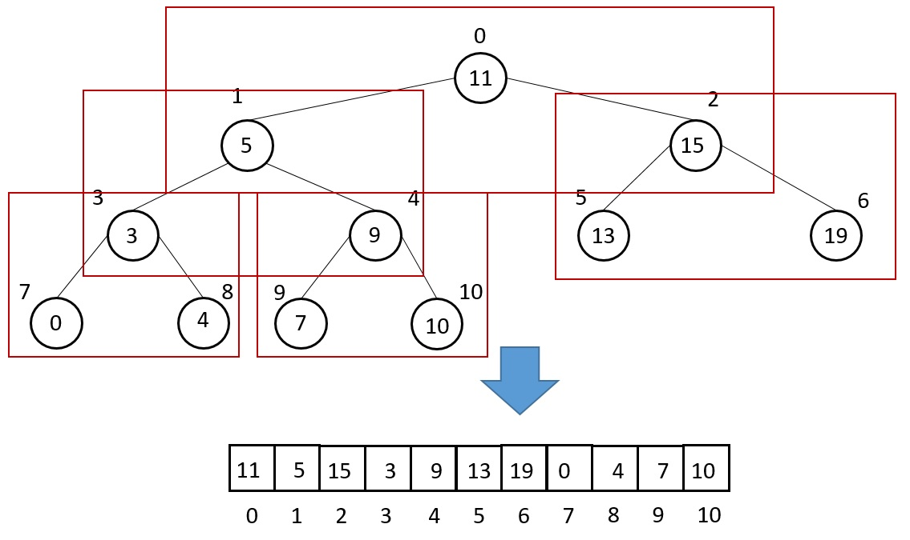
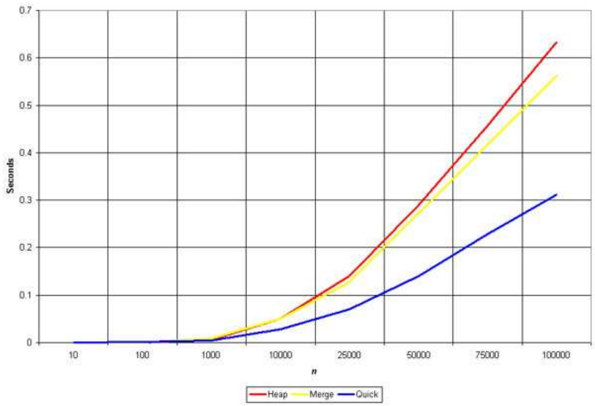

在前一篇介紹完了最容易想到的算法，但是該算法的時間複雜度有 O(n<sup>2</sup>)，所以需要從這些算法做改善。以下會介紹 O(nlogn) 的排序算法，也是較常使用的排序算法，如 Merge Sort、Quick Sort、Heap Sort。

## 1. 合併排序法 Merge Sort
1945 年由 John von Neumann 提出。從氣泡排序法可以看到，比較排序一定要將所有元素走訪一次，然後再讓元素倆倆比較，所以能改善的就是如何更有效率的比較兩元素。而合併排序法是將整個資料結構分成兩部分，一直分到每個部份僅有一個元素，然後倆倆比較後再合併，因為是與鄰近的相對極小值做比較，故兩值相同時不會交換相對位置，為穩定的排序算法。所以第一步是拆分，第二步是比較並合併。
因為每次合併都需要走訪 n 個元素，而合併需 log<sub>2</sub>n 步，要共需走訪 log<sub>2</sub>n 次，故共為 nlog<sub>2</sub>n 步，故時間複雜度為 O(nlog<sub>2</sub>n)，且因為是倆倆比較，所以不論是何種情況所需的時間複雜度為 O(nlog<sub>2</sub>n)。\
而在合併的過程中最多需要額外相同長度的記憶體空間，故空間複雜度為 Θ(n)。
```C
void merge(int a[], int head, int mid, int tail) 
{
    int i, j, k;
    int n1 = mid - head + 1;
    int n2 = tail - mid;
    int L[n1], R[n2];         //左右子陣列
    for (i = 0; i < n1; i++) L[i] = a[head + i];
    for (j = 0; j < n2; j++) R[j] = a[mid + 1+ j];
    i = 0, j = 0, k = head;
    while (i < n1 && j < n2) { //此迴圈將兩子陣列的元素倆倆比較並合併進原始陣列
        if (L[i] <= R[j]) a[k++] = L[i++];
        else a[k++] = R[j++];
    }
    while (i < n1) a[k++] = L[i++];
    //若左陣列較長，則把多餘的元素放在原始陣列最末端
    while (j < n2) a[k++] = R[j++];
    //若右陣列較長，則把多餘的元素放在原始陣列最末端
}

int min(int x, int y) { return (x < y) ? x : y;}
 
void mergeSort(int a[], int length)
{
    int curr_size;
    int head; 
    for (curr_size = 1; curr_size < length; curr_size = 2*curr_size) {
    //此迴圈用來合併子陣列用
        for (head = 0; head < length - 1; head += 2*curr_size) {
        //此迴圈用來走訪陣列中的每個元素
            int mid = min(head + curr_size - 1, length - 1);
            int tail = min(head + 2*curr_size - 1, length - 1);
            merge(a, head, mid, tail);
        }
    }
}
```
從遞迴寫法可以更容易地看出合併的特點。
```cpp
void merge(vector<int> &arr, int low, int mid, int high) {
    vector<int> res(high - low + 1);
    int i = low, j = mid + 1, k = 0;
    while(i <= mid && j <= high) {
        if(arr[i] <= arr[j]) res[k++] = arr[i++];
        else res[k++] = arr[j++];
    }
    while(i <= mid) res[k++] = arr[i++];
    while(j <= high) res[k++] = arr[j++];
    for(int x = 0; x < res.size(); x++) {
        arr[low + x] = res[x];
    }
}

void mergeSort(vector<int> &arr, int low, int high) {
    if(low < high) {
        int mid = low + (high - low) / 2;
        mergeSort(arr, low, mid);
        mergeSort(arr, mid + 1, high);
        merge(arr, low, mid, high);
    }
}
```
## 2. 快速排序法 Quick Sort
不同於合併排序，快速排序法並不一定會將資料等分，而是在取陣列中的某個值(pivot)當作二元樹的 root，接著若比 root 大就放右邊，反之放左邊。所以在最差的情況，也就是要將資料升序排列，但資料已經以降序的方式排列好了，需要 O(n<sup>2</sup>) 的時間複雜度。而平均情況下則是需要 O(nlog<sub>2</sub>n)。\
如同上面所提到的，因為是在資料中任選一個值，並利用一個相同長度的陣列存放，所以皆需要 Θ(n) 的額外記憶體空間。\
而快速排序法僅會將小於/大於 pivot 放一邊，所以當與 pivot 相等時也會做交換，雖然下列程式碼中 partition 內的判斷是只有小於，但最後的 arr[i+1] 與 arr[tail] 可能相等，固為不穩定的排序算法。
```C
void swap(int* a, int* b) {
    int temp = *a;
    *a = *b;
    *b = temp;
}
  
int partition(int a[], int head, int tail) {
    int i = (head - 1);
    for (int j = head; j <= tail - 1; j++)
        {if (a[j] < a[tail]) swap(&a[++i], &a[j]);}
    //在此選定 a[tail] 為 pivot，小於 pivot 放左邊，其餘放右邊
    swap(&a[i + 1], &a[tail]);
    //最後將 pivot 放到正確的位置，然後將 pivot 位置傳出來
    return (i + 1);
}
  
void quickSort(int a[], int length) {
    int head = 0, tail = length - 1, top = -1;
    int stack[length];
    //先將整段陣列複製出來，隨後任選一個值當作陣列 pivot 並做分段排序
    stack[++top] = head;
    stack[++top] = tail;
    while (top >= 0) 
    {
        tail = stack[top--];
        head = stack[top--];
  
        //將陣列分段後在選出下一個子陣列的 pivot 重複做，直到排序完成為止。
        int p = partition(a, head, tail);
  
        //將 pivot 左邊的元素從左邊放入 stack
        if (p - 1 > head) 
        {
            stack[++top] = head;
            stack[++top] = p - 1;
        }
  
        //將 pivot 左邊的元素從右邊放入 stack
        if (p + 1 < tail) 
        {
            stack[++top] = p + 1;
            stack[++top] = tail;
        }
    }
}
```
由上面的合併排序和快速排序看下來，兩者都是用 Divide and Conquer 方法來實現，只是合併排序注重的是合併資料，而快速排序注重的是分割資料。然而在 C 的標準函示庫中也有 qsort，使用方式請參考 [模擬泛型函數](https://github.com/JrPhy/C_tutorial/blob/main/CH5-%E6%8C%87%E6%A8%99%E8%88%87%E5%AD%97%E4%B8%B2.md#5-%E6%A8%A1%E6%93%AC%E6%B3%9B%E5%9E%8B%E5%87%BD%E6%95%B8)
同樣的，用遞迴寫法更容易看出做分割
```cpp
void quickSort(vector<int> &nums, int s, int e){
    if (s >= e) return;
    int i = s, j = s;
    int p = rand() % (e - s + 1) + s;
    swap (nums[e], nums[p]);
    int pivot = nums[e];
    while (j < e) {
        if (nums[j] <= pivot) swap(nums[i++], nums[j++]);
    }
    swap(nums[i],nums[e]);
    quickSort(nums, s, i-1);
    quickSort(nums, i+1, e);
}
```
## 3. 堆積排序法 Heap Sort
不同於前面兩種排序法，堆積排序是利用[完全二元樹](https://github.com/JrPhy/DS-AL/blob/master/Tree-%E4%BA%8C%E5%85%83%E6%A8%B9.md#2-%E5%AE%8C%E5%85%A8%E4%BA%8C%E5%85%83%E6%A8%B9-complete-binary-tree)，將陣列轉化成堆積(Heap)的概念來做排序。若為升序則稱最大堆積，降序則稱最小堆積，在此以升序排列為例。根節點為最大值且任一父節點的直皆大於子節點。\
在陣列中第一個位置(index = 0)為根，父節點 i 的左子節點在位置 2i+1，右子節點在位置 2i+2，子節點i的父節點在位置 floor((i-1)/2)，用此方式模擬樹狀結構。從根出發，在樹中比較每個子樹的父節點與子節點，將子樹中最小的值放到父節點，最大的值放在右子節點，並從最下面、最右邊的子樹開始，依序往左再往上，直到每個節點的葉子即完成排序，圖中每一個紅框為一個子樹。
\
在此算法中一樣要遍歷所有元素，然後每次建立堆積需要 O(logn) 的時間，故時間複雜度為 O(nlogn)。\
然而此堆積方式是利用欲排序的陣列模擬樹狀結構，故不再需要額外的陣列，空間複雜度為 Θ(1)。\
但是因為陣列中可能會有相同的值，有可能最末的葉子與根的值相同，故為非穩定排序算法。
```C
void swap(int *a, int *b) 
{
    int temp = *b;
    *b = *a;
    *a = temp;
}

void heapify(int a[], int head, int tail) {  //建立堆用
    int dad = head;
    int son = dad * 2 + 1;
    while (son <= tail) {
    // 若子節點指標在範圍內才做比較
        if (son + 1 <= tail && a[son] < a[son + 1]) son++;
        // 先比較兩個子節點大小，選擇最大的
        if (a[dad] > a[son]) return;
        // 如果父節點大於子節點代表調整完畢，直接跳出函數
        else
        // 否則交換父子內容再繼續子節點和孫節點比較
        {
            swap(&a[dad], &a[son]);
            dad = son;
            son = dad * 2 + 1;
        }
    }
}

void HeapSort(int a[], int len) 
{
    int i;
    for (i = len / 2 - 1; i >= 0; i--) heapify(a, i, len - 1);  // 建立 heap
    for (i = len - 1; i > 0; i--) 
    {
        swap(&a[0], &a[i]);  // 先將第一個元素和已排好元素前一位做交換
        heapify(a, 0, i - 1);  // 再重新調整，直到排序完畢
    }
}
```
Ref: \
[1]. https://www.youtube.com/watch?v=j-DqQcNPGbE \
[2]. https://www.zhihu.com/question/20842649 \
[3]. https://zh.wikipedia.org/wiki/%E5%A0%86%E6%8E%92%E5%BA%8F#C%E8%AF%AD%E8%A8%80

## 4. 三種排序法的適用情境與比較
Merge Sort、Quick Sort 和 Heap Sort、的平均時間複雜度皆為 O(nlogn)，且 Quick Sort 的最壞情況甚至要 O(n<sup>2</sup>)。對於陣列排序較常使用 Quick sort，原因是因為陣列是連續的記憶體，且若資料為雜亂無章的，Quick Sort 比較的步驟少於其他兩種方法，故在要排列陣列的情況使用 Quick sort 速度會較快。\
Merge Sort 和 Quick Sort 都是利用分治法來實現，只是一個重分割，一個重合併，可參考以下網頁來看出兩者差異。 \
https://www.cyut.edu.tw/~ckhung/b/al/sort1.php \
而 Merge sort 對於 linked list 的排列速度較快，原因是 linked list 牽扯到非連續記憶體與指標操作，所以此種情況下使用 Merge sort 速度會較快。而 Heap Sort 則是適用於 Priority Queue。\
\
Ref: \
[1]. https://www.geeksforgeeks.org/why-quick-sort-preferred-for-arrays-and-merge-sort-for-linked-lists/ \
[2]. https://stackoverflow.com/questions/1525117/whats-the-fastest-algorithm-for-sorting-a-linked-list \
[3]. http://www-cs-students.stanford.edu/~rashmi/projects/Sorting \
在[英文維基百科](https://en.wikipedia.org/wiki/Sorting_algorithm)中的排序算法條目中，整理了各排序算法的時間與空間複雜度和是否穩定，也可點進去各算法條目有詳盡的解釋與視覺化圖片。 
