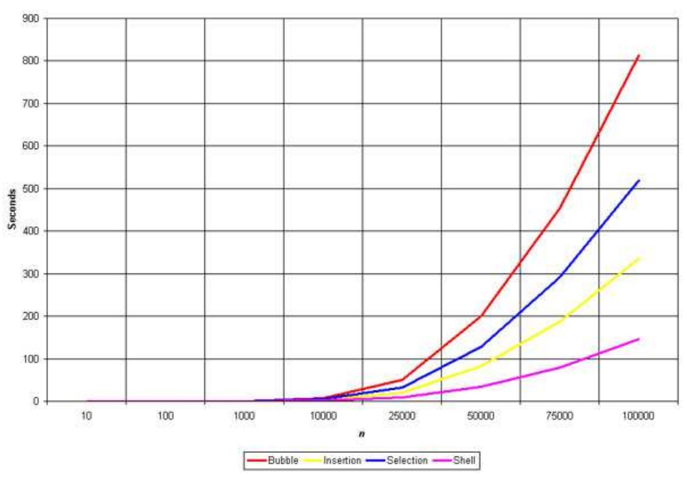

排序算法在日常生活中很常見，例如學號由小到大，作者名稱由 A ~ Z，分數由高到低等。而將資料做排序整理對未來的資料作尋找或整理可以加快速度，在電腦科學中也針對此算法做了許多研究。在排序算法種類若依照排序方式分類，可分成比較與非比較兩大類。若有 n 個元素要做排序，在比較算法中所需的時間複雜度目前最低就是 O(nlogn)，也就是將資料中兩個資料兩兩比較，最後就可以做排序。而非比較算法則非使用比較算法，有 n 個元素要做排序，數值為 0 ~ k，時間複雜度可以是 O(n+k)。\
若是照穩定性，也就是兩個相同的元素位置會不會互換，可分成穩定與不穩定。穩定的算法對於相同值的元素不會改變其**相對**位置。例如有一陣列 a[6] = {9, 3, 4, 5, 6, 5}，在做排序時可能會將原本 a[5] 的 5 換到 a[3] 的 5 左邊，若是一組資料結構不只一個 key，則不穩定的演算法會增加排序開銷。例如有一資料結構有學生學號與學生分數，原本是依照學號依序排序，現想將分數由大到小排序，而在相同分數下希望依照學生學號排序，這時不穩定的算法就有可能將原本已排好的學號錯置。\
``` (101, 60)、(102, 50)、(103, 60)、(104, 66)、(105, 58)、(106, 40)``` --> 排序後 ---> ``` (104, 66)、(103, 60)、(101, 60)、(105, 58)、(102, 50)、(106, 40)```\
在[維基百科](https://en.wikipedia.org/wiki/Sorting_algorithm)中有將多數排序算法的時間複雜度、空間複雜度、穩定性做整理。在此將會先從最容易想到的排序算法，如 Bubble Sort、Selection Sort、Insertion Sort 即期改良開始介紹，之後再介紹較常使用的排序算法。

## 1. 氣泡排序法 Bubble Sort
氣泡排序法是最直覺可以想到的排序方法，主要就是將兩元素拿來做比較，先用一個 index 從頭開始掃，再用另外一個 index 與相鄰元素比較，此種作法在升序排列中，第一步會將最大值擺到最後，所以共需要 1+2+3+...+(n-1) = n(n-1)/2 步，時間複雜度為 O(n<sup>2</sup>)。其過程像是泡泡一樣從下面跑上來，故稱氣泡排序法。而在算法中僅需要多一個變數即可完成，故空間複雜度為 O(1)。而氣泡排序是將鄰近的元素倆倆交換，故為穩定的算法。也可看到 bubbleSort 的程式碼非常短，故在欲排序的資料非常少時可以考慮使用。
```C
void bubbleSort(int a[], int length)
{
    int i, j, temp;
    for(i = 0; i < length; i++)
    {
        for(j = 0; j < length - 1 - i; j++)
        {
            if(a[j] > a[j+1])
            {
                temp = a[j];
                a[j] = a[j+1];
                a[j+1] = temp;
            }
        }
    }
}
```
## 2. 選擇排序法 Selection Sort
假設為升序排列且有 n 個元素，先將所有元素中最小值找出來放到首位，接著找第 1~n 個元素中的最小值放到次位，以此類推，此即為選擇排序法。此種方法需要 n+(n-1)+(n-2)...+1 = n(n+1)/2，時間複雜度為 O(n<sup>2</sup>)。而在算法中僅需要多二個變數即可完成，故空間複雜度為 O(1)。而選擇排序是將最小的元素與第 i 個元素做交換，有可能會改變相同元素的相對位置。以下為其中一個例子： \
a[6] = {5, 3, 4, 5, 1, 8} 使用選擇排序法做升序排列，在此先找到 1 ~ 5 中的最小值與最後一個位置交換，這樣 a[0] 的 5 就會跑到 a[3] 右邊，所以是一個不穩定的算法。
```C
void selection_sort(int a[], int len) 
{
	int i,j,temp;
	for (i = 0 ; i < len - 1 ; i++) 
    {
        int min = i;
		for (j = i + 1; j < len; j++) if (a[j] < a[min])  min = j;  //走訪未排序的元素，找到並紀錄最小值
		if(min != i)
		{
            temp=a[min];  //交換兩個變數
            a[min]=a[i];
            a[i]=temp;
		}
	}
}
```
## 3. 插入排序法 Insertion Sort
在撲克牌理牌的時候會將第 i 張牌與 0 ~ i-1 張牌作比較，當該張牌小於裡面的某個值，就把該張牌插入該位置，並將排由後往前交換使得值能夠依序排列，此即為插入排序法的想法。而此種排序法共需要 1+2+3+...+(n-1) = n(n-1)/2，時間複雜度為 O(n<sup>2</sup>)。而在算法中僅需要多一個變數即可完成，故空間複雜度為 O(1)。而氣泡排序是將鄰近的元素倆倆交換，故為穩定的算法。
```C
void insertionSort(int a[], int n)
{
    int i, j, temp;
    for(i = 1; i < n; i++)
    {
        temp = a[i];
        j = i-1;
        while(j >= 0 && a[j] > temp)
        {
            a[j+1] = a[j];
            j--;
        }
        a[j+1] = temp;
    }
}
```
雖然以上三種算法在時間複雜度上皆為 O(n<sup>2</sup>)，但實際上還是有些許差異，下表給出此三種算法在給定相同的資料量下，Insertion Sort 所花費的時間最少。
 \
Ref: http://www-cs-students.stanford.edu/~rashmi/projects/Sorting \

## 4. Shell Sort

