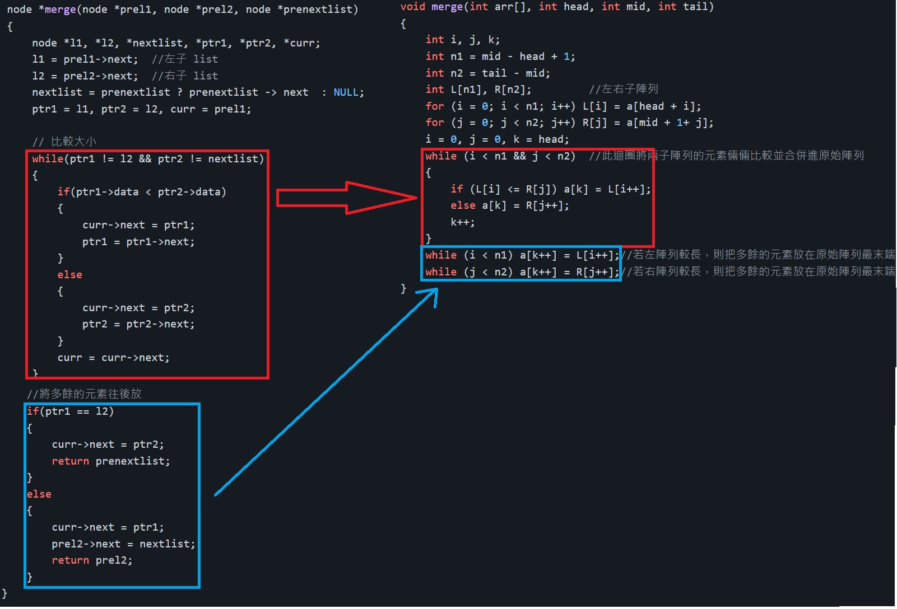

因為 linked list 不是 C 語言內建的資料結構，故 C 中的 qsort 並不支援 list 的排序，需要自己寫。而兩者的差異在於 array 可以直接使用 index 做操作，list 沒辦法，所以在 list 寫法上會比較複雜。但可以藉由末節點指向 NULL 來計算長度。當然也可以將 list 裡面的元素用 array 儲存起來，在對 array 排序完後就放進 list 中。\
而排序僅是交換結構中 data 的位置，並不會改變鏈結的串接順序，但鏈結無法像陣列一樣直接取用位置，故兩者差異在於如何走訪所有元素。

## 1. 氣泡排序法
氣泡排序法因為是與鄰近的元素倆倆比較，所以在實作上幾乎與 array 版本無差別。
```C
void bubbleSort(node **list)
{
    int i, j, a;
    node *temp1 = NULL, *temp = NULL;

    for(temp1 = *list; temp1 != NULL; temp1 = temp1->next)
    {
        for(temp2 = temp1->next; temp2!=NULL; temp2 = temp2->next)
        { 
            if(temp2->data < temp1->data)
            {
                a = temp1->data;
                temp1->data = temp2->data;
                temp2->data = a;
            }
        }
    }
}
```

## 2. 合併排序法
此寫法也與陣列版差異不大，只是要將陣列操作改成 list 操作。
```c
node *next(node *a, int size)
{  
    while(a && size--) a = a->next;
    return a;
}

node *merge(node *prel1, node *prel2, node *prenextlist)
{
    node *l1, *l2, *nextlist, *ptr1, *ptr2, *curr;
    l1 = prel1->next;  //左子 list
    l2 = prel2->next;  //右子 list
    nextlist = prenextlist ? prenextlist -> next  : NULL;
    ptr1 = l1, ptr2 = l2, curr = prel1;
    
    // 比較大小
    while(ptr1 != l2 && ptr2 != nextlist)
    {
        if(ptr1->data < ptr2->data)
        {
            curr->next = ptr1;
            ptr1 = ptr1->next;
        }
        else
        {
            curr->next = ptr2;
            ptr2 = ptr2->next;
        }
        curr = curr->next;
    }
    
    //將多餘的元素往後放
    if(ptr1 == l2)
    {
        curr->next = ptr2;
        return prenextlist;
    }
    else
    {
        curr->next = ptr1;
        prel2->next = nextlist;
        return prel2;
    }
}

void mergeSortL(node **list)
{
    int size = 1;

    node *preList = newNode(0);
    preList->next = *list;

    node *head, *tail, *mid;
    head = preList;
    while((tail = next(head, size)))
    {
        while(head && tail -> next)
        {
            mid = next(tail, size);
            head = merge(head, tail, mid);
            tail = next(head, size);
        }
        size +=size;  //1, 2, 4, ... --> O(nlogn)
        head = preList;
    }
    *list = preList->next;
}
```


